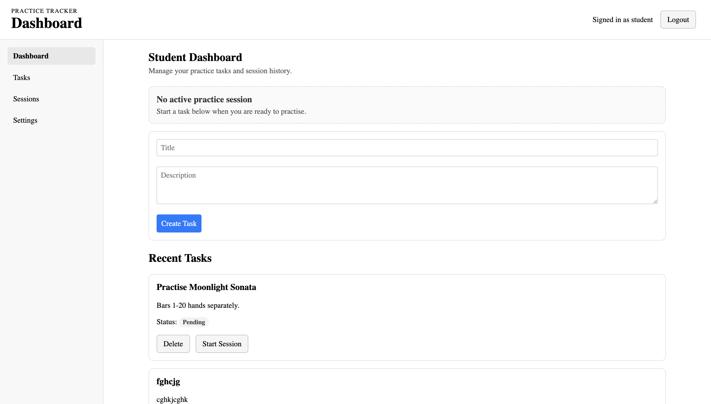
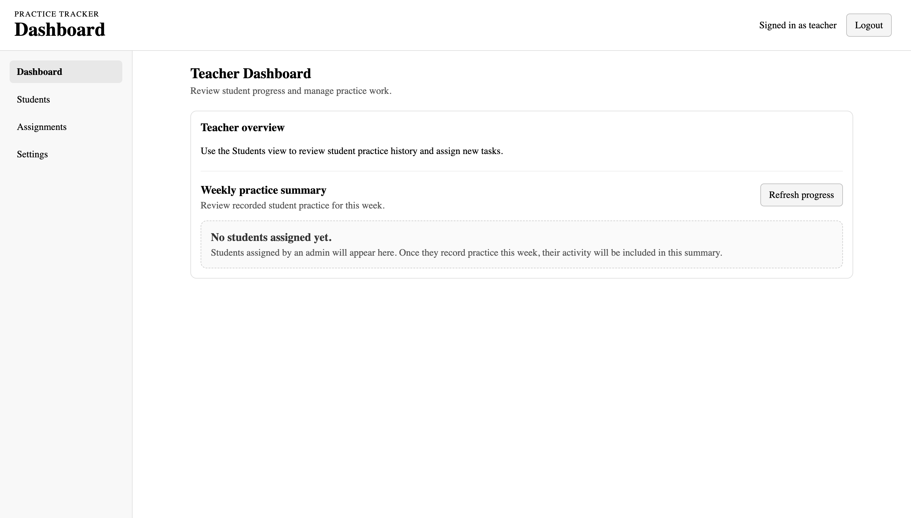
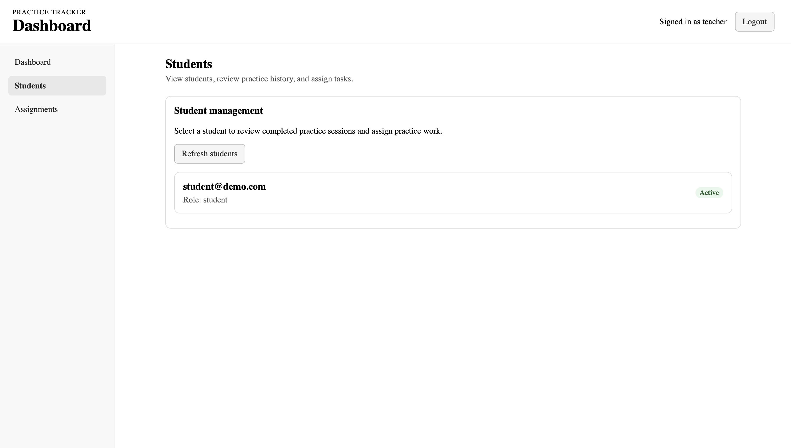
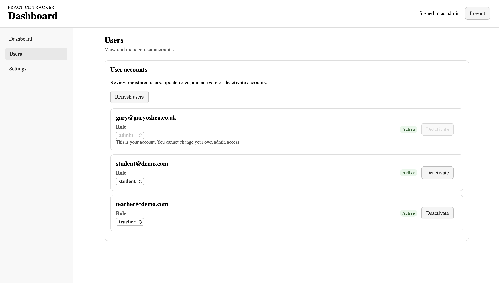

# Practice Logger UI

React frontend for a FastAPI-powered music practice tracking application.

This project is part of a full-stack portfolio app designed for music students and teachers. Students can manage practice tasks, start and end practice sessions, and review session history. Teachers can view students assigned to them, inspect student practice history, and assign practice tasks. Admins can manage user accounts and assign students to teachers.

## Live App

- Live app: https://practice-logger.netlify.app/
- Backend API: https://practice-logger-backend-production.up.railway.app/
- API docs: https://practice-logger-backend-production.up.railway.app/docs
- Backend repo: https://github.com/ConForza/Practice-Logger-Backend

## PWA Support

Practice Logger can be installed as a Progressive Web App, allowing students and teachers to launch it from a phone or tablet home screen.

## Tech Stack

- React
- Vite
- JavaScript
- CSS
- FastAPI backend
- PostgreSQL database
- Netlify

## Screenshots

### Student dashboard



### Teacher dashboard



### Teacher student panel



### Admin users panel



## Current features

### Authentication

- Login and registration flow
- JWT token storage and restore
- Current user fetch via `/auth/me`
- Role-based dashboard rendering

### Student features

- Student dashboard with task management
- Create and delete practice tasks
- Start and end practice sessions
- Active practice session restore
- Session history view
- Helpful empty states for tasks and sessions
- Teacher-assigned tasks appear in the student task list
- Teacher-assigned tasks are labelled as “Assigned by your teacher”
- Student-created tasks remain separate/general tasks

### Teacher features

- Teacher dashboard with role-aware navigation
- View only students assigned by an admin
- Selected student detail panel
- Selected student practice session history
- Teacher task assignment form
- Recently assigned task confirmation
- Weekly practice summary for assigned students
- Refresh and retry states for student/session/progress data
- Helpful empty states when no students are assigned
- Form validation and success/error feedback

### Admin features

- View user accounts
- Change user roles
- Activate and deactivate accounts
- Protect current admin account from accidental self-demotion or deactivation
- Reset user passwords
- Assign students to teachers
- View current teacher-student assignments
- Prevent duplicate teacher-student assignments
- Remove teacher-student assignments

### Layout and UI

- Responsive app shell
- Navbar with current role display
- Sidebar navigation for desktop
- Bottom navigation on mobile
- Sidebar view switching
- Loading and error states

## Related backend

This frontend connects to the Practice Logger FastAPI backend:

[Practice Logger Backend](https://github.com/ConForza/Practice-Logger-Backend)

The backend provides:

- JWT authentication
- Register/login endpoints
- Current user endpoint
- Task CRUD
- Practice session start/end
- Active session restore
- Session history
- Role-based access helpers
- Admin-managed teacher-student ownership
- Teacher access restricted to assigned students
- Teacher-assigned task labelling
- Weekly progress summaries for assigned students

## Getting started

Install dependencies:

```bash
npm install
```

Run the development server:

```bash
npm run dev
```

The backend API should also be running locally.

Example backend command:

```bash
uvicorn main:app --reload
```

## Environment/configuration

The frontend API base URL is currently configured in:

```txt
src/services/api.js
```

For local development, the backend should be available at the URL used by that service file.

## Project structure

```txt
src/
├── components/
│   ├── admin/
│   ├── layout/
│   ├── student/
│   └── teacher/
├── services/
│   └── api.js
├── App.jsx
├── App.css
└── main.jsx
```

## Environment Variables

Create a .env file in the project root:

```env
VITE_API_BASE_URL=http://localhost:8000/api/v1
```

For production on Netlify, this points to the deployed Railway API:

```env
VITE_API_BASE_URL=https://practice-logger-backend-production.up.railway.app/api/v1
```

## Current status

The student, teacher, and admin workflows are functional and deployed. Students can manage tasks and log practice sessions. Teachers can view assigned students, review student practice history, assign tasks, and view weekly practice summaries. Admins can manage users and teacher-student assignments.

## Planned improvements

- Multi-task practice sessions
- More detailed progress statistics
- Persistent login / refresh tokens
- Alembic-backed database migrations
- Expanded automated tests
